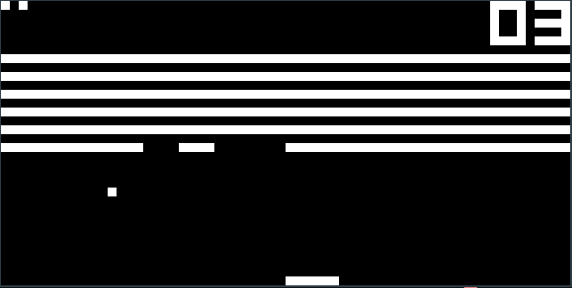
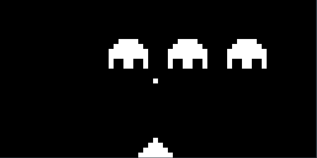
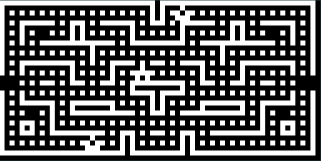
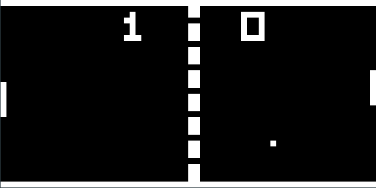

# Chip 8
Chip 8 emulator made in Go. Games are taken from [here](https://github.com/badlogic/chip8/tree/master/roms)

# Download
```
go get -u github.com/nishantc1527/chip8
```

Make sure to put $GOPATH/bin in your path.

# Usage
```
usage: Chip 8 [-h|--help] [-l|--list] [-g|--game "<value>"] [-r|--rom
              "<value>"] [-a|--no-audio]

              
  _____ _     _          ___  
 / ____| |   (_)        / _ \ 
| |    | |__  _ _ __   | (_) |
| |    | '_ \| | '_ \   > _ < 
| |____| | | | | |_) | | (_) |
 \_____|_| |_|_| .__/   \___/ 
               | |            
               |_|            

A Complete Chip 8 Emulator


Arguments:

  -h  --help      Print help information
  -l  --list      List All Inbuilt Games. Default: false
  -g  --game      Inbuilt Game To Play. Default: pong2
  -r  --rom       Path To Rom File
  -a  --no-audio  If True, Beeping Sounds Will Be Played. Default: false
```
